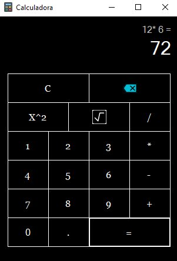

# Windows-Calculator-Clone
A simple Windows 10 Calculator Clone coded with C# .NET Framework 4.8.
Un simple clon de la calculadora de Windows 10 programada con C# .NET Framework 4.8.

# Install and run / Instalar y correr
In order to run this program you need to download the release folder and run the .exe file on it. / Para correr este programa es necesario descargar la carpeta release y ejecutar el archivo .exe dentro de ella.

  

